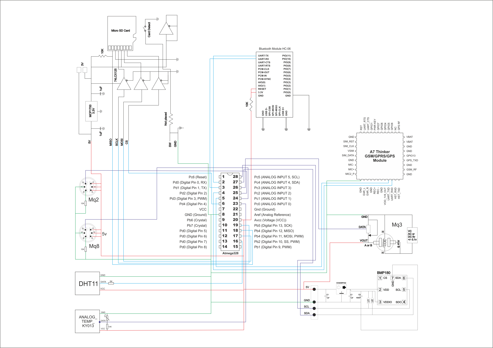

# EWA
EWA (Environment with Application) - open source project for measure of environment (weather stratosphere and troposphere) on Arduino Platform and send data from sensors in 3G networks to Control Panel. 

